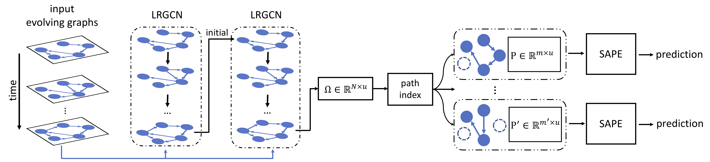

# Predicting Path Failure In Time Evolving Graphs



The Tensorflow implementation of our KDD 2019 work: Predicting Path Failure In Time Evolving Graphs.

Details can be found in our paper: [Predicting Path Failure In Time Evolving Graphs](https://arxiv.org/abs/1905.03994).

## Data
The traffic data used for the experiments is stored in the `DATA` folder. The original data can be downloaded from: http://pems.dot.ca.gov/ . Note that every data file need to be unzip at first.

In order to use your own data, you need to provide
* the input feature tensor, its size is T by N by d (number of timesteps, number of nodes, number of feature dimension). 
* the path label matrix (0/1 matrix), its size is T by k (number of timesteps, number of paths).
* the adjacent matrix list, its size is (1+T) by N by N (1 initial state + number of timesteps, number of nodes, number of nodes). adj_list[t] corresponds to the adjacent matrix of the time evolving graph at time t. Note that the first adjacent matrix (adj_list[0]) corresponds to the underline graph. For the static graph, use the same adjacent matrix.

See the `load_data.py` file for example.

## Requirements
* tensorflow
* networkx
* pickle

## Run the model
```bash
# Train the model with the provided traffic data (Note the provided data files need to be unzip first)
python LRGCN_SAPE.py --train True

# Change the training epochs
python LRGCN_SAPE.py --train True --num_epochs 30

# Run the pre-trained model
python LRGCN_SAPE.py
```

## Citation
```
@inproceedings{li2019predicting,
  title={Predicting Path Failure In Time-Evolving Graphs},
  author={Li, Jia and Han, Zhichao and Cheng, Hong and Su, Jiao and Wang, Pengyun and Zhang, Jianfeng and Pan, Lujia},
  booktitle={Proceedings of the 25th ACM SIGKDD International Conference on Knowledge Discovery and Data Mining (KDD)},
  year={2019}
}
```

​	